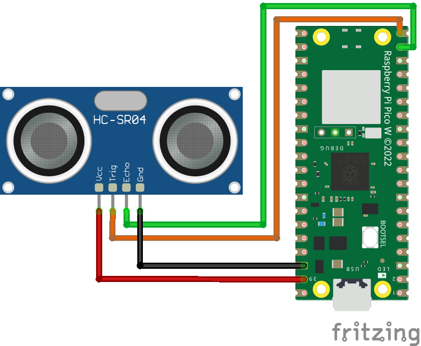

# Raspberry Pi Pico W + HC-SR04

A custom distance sensor using a Pi Pico + HC-SR04 for HomeAssistant.

See https://github.com/ochorocho/pico_distance_component for the HomeAssistant custom component.

### Connect the sensor to your Pico W:



### Create a `.env` file and adjust the variables to your needs:

```
WIFI_NAME=YOUR_WIFI_SSID
WIFI_PASSWORD=YOUR_PASSWORD
SENSOR_TRIG=15
SENSOR_ECHO=14
```

### Upload the following files:
    
* `main.py` - the entrypoint, thread for webserver/network, thread to get the HC-SR04 sensor value in cm
* `tools.py` - methods for the sensor and wifi
* `.env` [file](.env.example) - Wifi connection and pin configuration

# Credits

 * Wifi manager from https://github.com/tayfunulu/WiFiManager